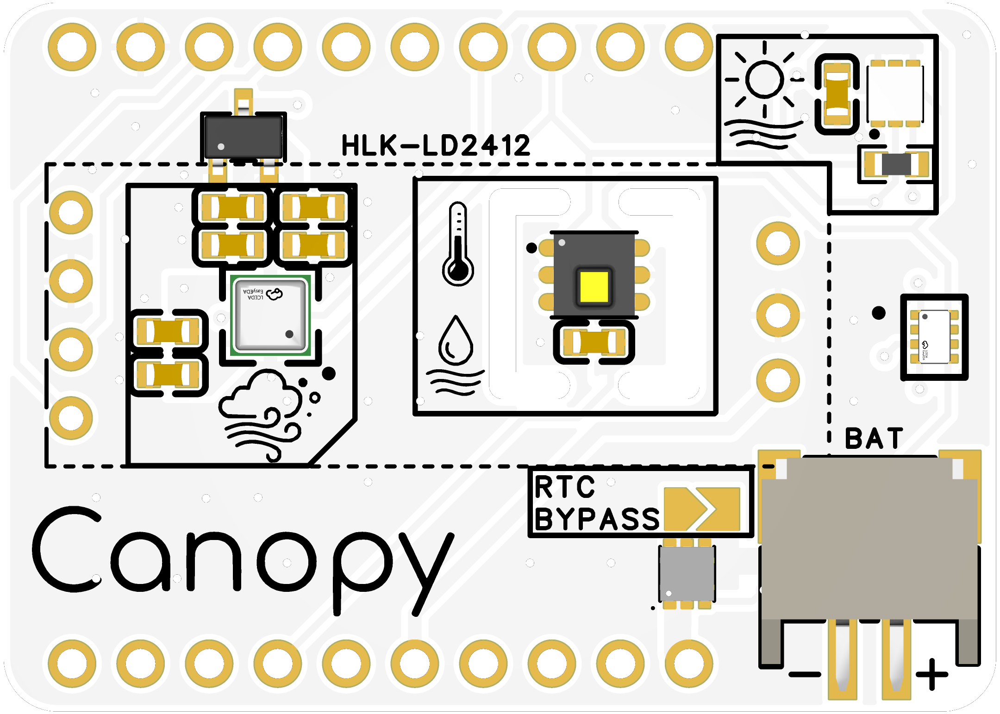
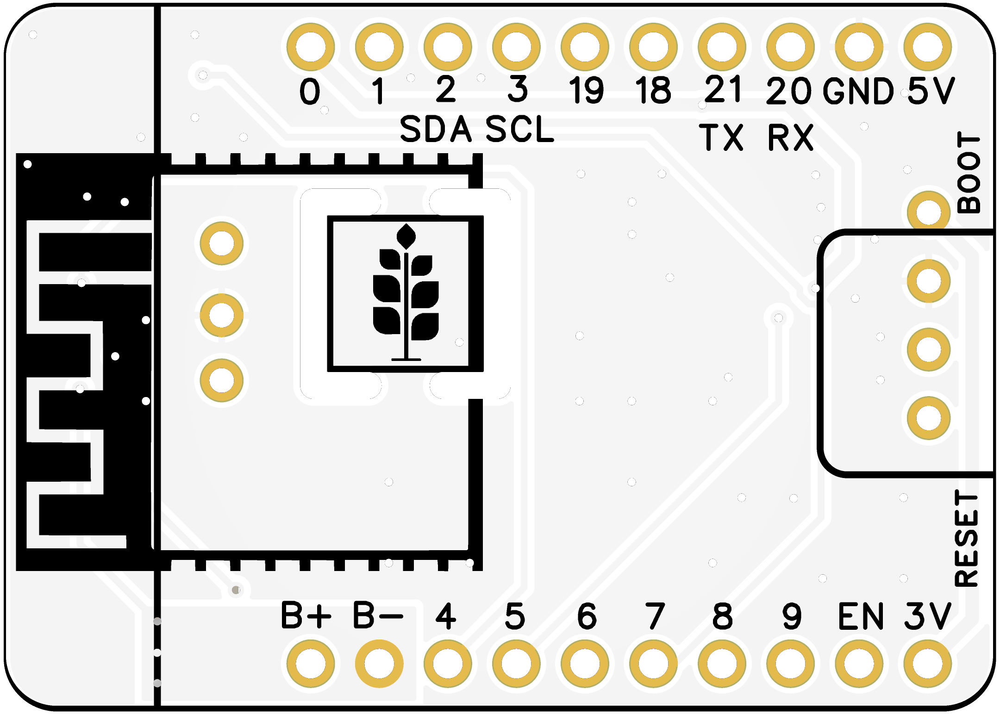
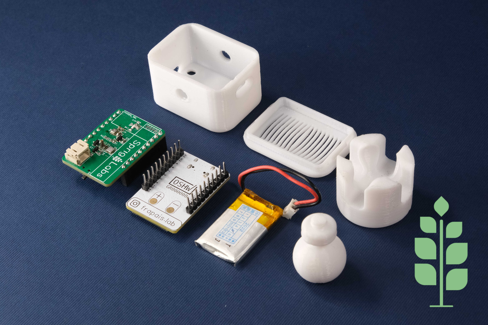
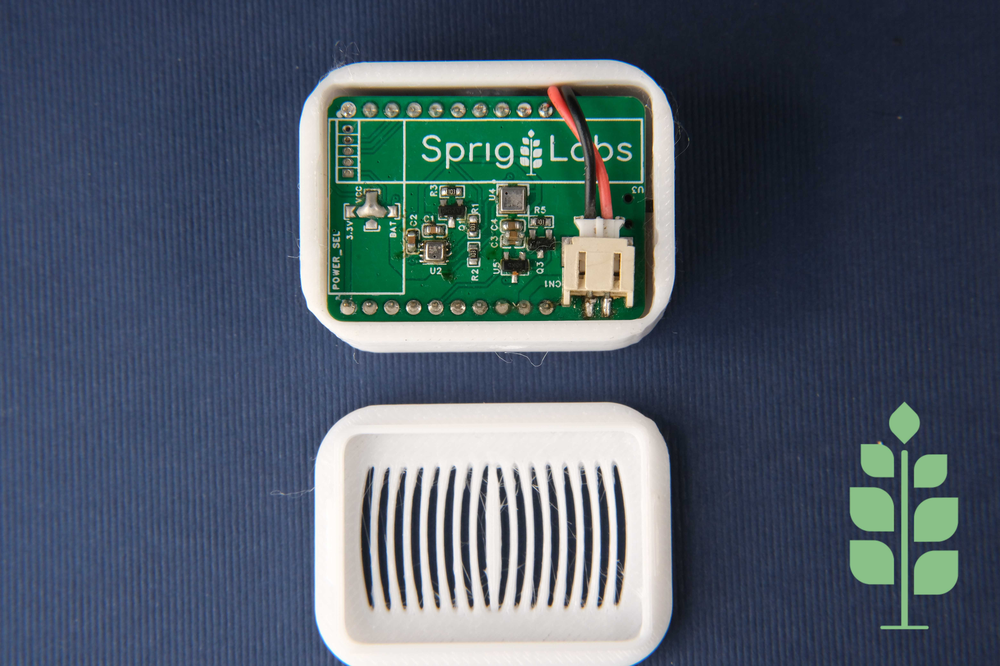

# Canopy — Environmental & Presence Module

**Canopy** is an expansion module from the **SprigStack** ecosystem. It plugs directly onto the pin headers of a [**Sprig-C3**](https://github.com/Frapais/Sprig-C3) ESP32-C3 development board and turns it into a complete, battery-powered environmental and presence sensor for Home Assistant.

|  |  |
| --- | --- |
|  |  |

---

## Contents

- [Features](#features)
- [Sensors](#sensors)
- [Pinout](#pinout)
- [Power management](#power-management)
- [Real-time clock](#real-time-clock)
- [Enclosure](#enclosure)
- [Firmware](#firmware)
  - [ESPHome setup](#esphome-setup)
  - [MQTT setup](#mqtt-setup)
- [Repository structure](#repository-structure)
- [Availability](#availability)
- [Support](#support)
- [License](#license)

---

## Features

- Air temperature and relative humidity
- Air quality: **AQI**, **eCO₂** and **TVOC**
- Ambient light in lux
- 24 GHz **mmWave human presence** detection, including stationary targets (TODO)
- On-board **real-time clock** with a solder-jumper bypass (TODO)
- Independent **power gating** of every sensor via GPIO, for true low-power deep-sleep operation
- Secondary **battery connector** passed through to the Sprig-C3
- Stacks directly onto the Sprig-C3 / C6 headers — no wiring
- Designed to fit the 3D-printed ball-joint enclosure included in this repo

---

## Sensors

| Function | Part | Interface | Address | Power enable |
| --- | --- | --- | --- | --- |
| Air temperature & humidity | HDC1080 | I²C | `0x40` | GPIO **8** |
| Air quality (AQI / eCO₂ / TVOC) | ENS160 | I²C | `0x53` | GPIO **0** |
| Ambient light | VEML6030 | I²C | `0x48` | GPIO **7** |
| Human presence | HLK-LD2412 | UART | — | <!-- TODO: enable pin, or always-on --> |
| Real-time clock | <!-- TODO: part number --> | I²C | <!-- TODO --> | always on (see [RTC](#real-time-clock)) |
| Battery gauge | MAX17048 *(on the Sprig-C3)* | I²C | `0x36` | always on |

> The VEML6030 responds at `0x48` when its ADDR pin is pulled high and `0x10` when pulled low. The ENS160 responds at `0x53` or `0x52` in the same way. Run an I²C scan on first power-up to confirm what your board reports.

---

## Pinout

Canopy uses the following Sprig-C3 pins. **Every other pin on the headers is passed straight through** and remains free for your own use.

| Sprig-C3 pin | Used for |
| --- | --- |
| 2 | I²C **SDA** — all I²C sensors + RTC + fuel gauge |
| 3 | I²C **SCL** |
| 8 | HDC1080 power enable (active high) |
| 0 | ENS160 power enable (active high) |
| 7 | VEML6030 power enable (active high) |
| 20 / 21 | HLK-LD2412 **RX / TX** <!-- TODO: confirm orientation --> |
| 3V3, GND | Module supply |


### Strapping-pin note

GPIO **8** is a strapping pin on the ESP32-C3 and must read high at reset. It is an input for the first few hundred milliseconds after power-up, so if the HDC1080 rail pulls it low during that window the board will not boot. GPIO **9** (BOOT) and GPIO **2** (SDA, held high by the bus pull-ups) are the other two strapping pins. GPIO **0** and **7** are unrestricted.

---

## Power management

Each environmental sensor is fed from a GPIO rather than the main 3V3 rail, so firmware can cut its supply entirely before entering deep sleep. Combined with the Sprig-C3's ~66 µA idle draw, this is what makes multi-month battery life realistic.

```
digitalWrite(PWR_HDC1080,  HIGH);   // GPIO 8
digitalWrite(PWR_ENS160,   HIGH);   // GPIO 0
digitalWrite(PWR_VEML6030, HIGH);   // GPIO 7
delay(50);                          // let the rails settle before I²C
```

Two things to keep in mind:

- **The ENS160 needs warm-up time.** Its gas readings are only meaningful after roughly 3 minutes of continuous operation, and the sensor requires a one-time 24-hour burn-in when new. Power-gating it on a short cycle means it never leaves warm-up, so keep it powered for update intervals below ~10 minutes.
- **GPIO 7 and 8 are not RTC-capable** on the ESP32-C3, so they float during deep sleep. Call `gpio_deep_sleep_hold_en()` and `gpio_hold_en()` on them before sleeping, or those rails will drift.

---

## Real-time clock

Canopy carries an on-board RTC so the node can keep accurate time across deep-sleep cycles and power loss without a network round trip.

The **RTC BYPASS** solder jumper on the underside of the board <!-- TODO: confirm default state and what bridging it does — e.g. "bridge to disconnect the RTC backup supply and eliminate its standby draw" -->.

---

## Enclosure

The `Enclosure/` folder contains a two-part sensor housing and a matching ball-joint mount, so the module can be aimed at whatever the mmWave sensor should be watching.

| Part | File | Size (mm) |
| --- | --- | --- |
| Enclosure body | `Env sensor enclosure - Body.stl` | 32.1 × 42.8 × 24.4 |
| Enclosure lid | `Env sensor enclosure - Lid.stl` | 32.1 × 42.8 × 6.0 |
| Ball (attaches to body) | `Ball Joint - ball.stl` | 20.0 × 20.0 × 29.4 |
| Mount cup (attaches to surface) | `Ball Joint - mount.stl` | 30.0 × 30.0 × 23.0 |
| Full assembly | `Assembly.step` | — |

### Printing

| Setting | Recommendation |
| --- | --- |
| Material | PLA or PETG |
| Layer height | 0.16–0.20 mm |
| Walls | 3 perimeters |
| Infill | 20% |
| Supports | Not required for the body or lid; the ball joint prints best stem-up |

The vented face of the lid must stay clear — it is the airflow path to the HDC1080 and ENS160. Do not fill it with supports or paint over it. The lid is deliberately thin in front of the mmWave module so the 24 GHz signal passes through; avoid metallic or carbon-filled filaments, which will block it.

<!-- TODO: hardware list — screw size and count for lid, whether the ball is a friction fit or needs a screw -->

---

## Firmware

Two paths are supported. ESPHome is the fastest way to get entities into Home Assistant; the Arduino/MQTT sketch is for anyone who wants full control or is not running ESPHome.

### ESPHome setup

**Requirements:** Home Assistant with the ESPHome add-on installed.

1. Plug the Canopy onto the Sprig-C3, then connect the Sprig-C3 to the machine running Home Assistant while holding **BOOT** (only needed the first time).
2. In ESPHome, add a new device and pick **ESP32-C3**.
3. Replace the generated YAML with the contents of [`Firmware/ESPHome/canopy.yaml`](Firmware/ESPHome/canopy.yaml).
4. Set `wifi_ssid` and `wifi_password` in your ESPHome `secrets.yaml`.
5. Upload, selecting the port that appears as a **USB JTAG** device.
6. Configure the newly discovered device from Home Assistant settings.

### MQTT setup

**Requirements:** an MQTT broker (tested with Mosquitto) and the Home Assistant MQTT integration, plus the Arduino IDE.

1. Open [`Firmware/MQTT/Canopy_C3_mqtt/Canopy_C3_mqtt.ino`](Firmware/MQTT/Canopy_C3_mqtt/Canopy_C3_mqtt.ino).
2. Install the required libraries from the Library Manager:
   - PubSubClient (Nick O'Leary)
   - ArduinoJson v6.x (Benoit Blanchon)
   - Adafruit MAX1704X
   - ClosedCube HDC1080
   - SparkFun Indoor Air Quality Sensor — ENS160
   - SparkFun Ambient Light Sensor (VEML6030)
3. Select **ESP32C3 Dev Module** as the board and upload.
4. On first boot the node opens an open WiFi access point named **`Canopy-Setup`**. Join it from a phone or laptop; the captive portal appears automatically, or browse to `http://192.168.4.1`.
5. Enter your WiFi credentials and MQTT broker address, port, username and password, then save. The node reboots and connects.
6. Entities appear in Home Assistant automatically through MQTT discovery — no manual topic entry needed. All readings are published every 60 seconds to `canopy/<device-id>/state` as a single JSON payload, with availability on `canopy/<device-id>/status`.

Hold the **BOOT** button for 5 seconds at any point to erase the stored credentials and reopen the setup portal.

---

## Repository structure

```
Canopy-Environmental-and-Presence-module/
├── README.md
├── LICENSE
├── PCB/
│   ├── Canopy-schematic.pdf          # exported schematic, readable without EDA software
│   ├── Canopy-BOM.csv                # bill of materials
│   ├── Gerbers/                      # zipped fabrication files
│   ├── EasyEDA/                      # source project files
│   └── Images/                       # renders: top, bottom, pinout
├── Firmware/
│   ├── ESPHome/
│   │   └── canopy.yaml               # full ESPHome configuration
│   └── MQTT/
│       └── Canopy_C3_mqtt/
│           └── Canopy_C3_mqtt.ino    # standalone Arduino sketch with setup portal
└── Enclosure/
    ├── Env sensor enclosure - Body.stl
    ├── Env sensor enclosure - Lid.stl
    ├── Ball Joint - ball.stl
    ├── Ball Joint - mount.stl
    ├── Assembly.step
    └── Images/                       # renders of the assembled unit
```

---

## Availability

Assembled Canopy modules and Sprig-C3 boards are available from [Tindie](https://www.tindie.com/stores/spriglabs/), [Lectronz](https://lectronz.com/), and the [Sprig Labs store](https://sprig-labs.com/store).

---

## Support

If you find this project useful, consider supporting its development:

- [PayPal](https://www.paypal.com/paypalme/kostasparaskevas)
- [Buy Me a Coffee](https://www.buymeacoffee.com/spriglabs)
- Instagram: [@sprig_labs](https://www.instagram.com/sprig_labs/)

---

## License

Released under the **GPL-3.0** license. See [LICENSE](LICENSE).
